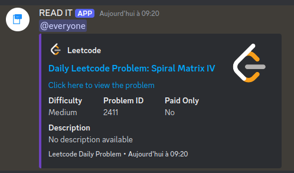
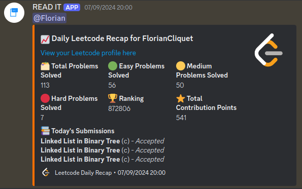
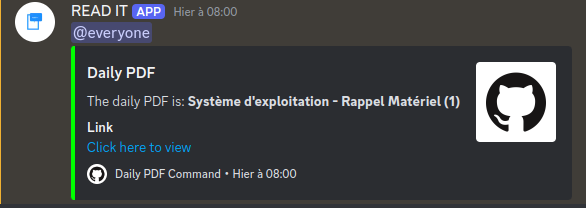
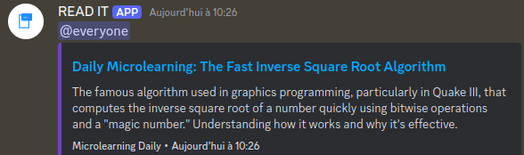

# Daily Microlearning Discord Bot

Welcome to the **Daily Microlearning Discord Bot**! This bot helps you engage with daily microlearning activities on Discord by automating various tasks and providing helpful commands. It's designed to run scheduled tasks, handle commands, and interact with a MongoDB database.

## Table of Contents

- [Features](#features)
- [Installation](#installation)
- [Usage](#usage)
- [Code Structure](#code-structure)
- [Contributing](#contributing)
- [License](#license)

## Features

- **Scheduled Tasks**: Automatically runs tasks at specified times (e.g., daily recaps, LeetCode challenges).
- **Command Handling**: Add, delete, and display information related to LeetCode accounts, PDFs, and microlearning resources.
- **Database Integration**: Uses MongoDB for storing and managing data.

## Installation

1. **Clone the Repository**:

   ```bash
   git clone https://github.com/yourusername/Daily-Microlearning-Discord-Bot.git
    ```
2. **Navigate to the Project Directory:**

    ```bash
    cd Daily-Microlearning-Discord-Bot
    ```
3. **Install Dependencies:**
    Make sure you have Node.js installed. Then, run:
    ```bash
    npm install
    ```
4. **Set Up Environment Variables:**
    Change the .env with your info
    ```makefile
    DISCORD_TOKEN=yourdiscordtoken // required
    MONGODB_URL=mongodb://localhost:27017 // Default mongosh port
    CHANNEL_PDF_ID=discord-channel-id // required
    CHANNEL_LEETCODE_ID=discord-channel-id // required
    CHANNEL_LEETCODE_RECAP_ID=discord-channel-id // required
    CHANNEL_MICROLEANRING_ID=discord-channel-id // required
    MONGODB_DATABASE_NAME=READ_IT // Default database name, you can change if you want
    MONGODB_MASTER_COLLECTION_NAME=masterpdf // Default Collection name
    MONGODB_PDF_COLLECTION_NAME=pdf // Default Collection name
    MONGODB_LEETCODE_COLLECTION_NAME=LEETCODE // Default Collection name
    MONGODB_INDEX_COLLECTION_NAME=indexes // Default Collection name
    MONGODB_MICROLEARNING_COLLECTION_NAME=microlearning // Default Collection name
    MORNING_HOUR=7 // Default value, you can change as you wish
    EVENING_HOUR=16 // same
    ```

5. **Set Up Config.json:**
    Change the config.json with your info (The bot wasn't working with only .env info idk why)
    ```json
    {
    "clientId": "your-discord-clientId", // required
    "guildId": "your-discord-guildId", // required
    "token": "your-discord-token", // required
    "API_DAILY_LEETCODE": "https://alfa-leetcode-api.onrender.com/daily", // Do not change
    "API_LEETCODE_ACCOUNT": "https://leetcode-api-faisalshohag.vercel.app/" // Do not change
    }
    ```
6. **Download and Install `mongosh`:**

   If `mongosh` (MongoDB Shell) is not already installed on your system, follow these steps to get it set up:

   1. **Download `mongosh`:**
      - Visit the [MongoDB Download Center](https://www.mongodb.com/try/download/shell).
      - Choose the appropriate version for your operating system (Windows, macOS, or Linux).
      - Download the installer or archive file.

   2. **Install `mongosh`:**
      - **For Windows:**
        - Run the downloaded installer (.msi file) and follow the installation prompts.
        - Optionally, add `mongosh` to your system's PATH during the installation for easier access from the command line.

      - **For macOS:**
        - If you have [Homebrew](https://brew.sh/) installed, you can easily install `mongosh` with:
          ```bash
          brew tap mongodb/brew
          brew install mongosh
          ```
        - Alternatively, if you downloaded a `.tgz` file, extract it and follow the instructions in the included `README` file.

      - **For Linux:**
        - You can use a package manager to install `mongosh`. For example, on Ubuntu, you can run:
          ```bash
          wget -qO - https://www.mongodb.org/static/pgp/server-5.0.asc | sudo apt-key add -
          echo "deb [ arch=amd64 ] https://repo.mongodb.org/apt/ubuntu $(lsb_release -cs) 10gen" | sudo tee /etc/apt/sources.list.d/mongodb-org-5.0.list
          sudo apt-get update
          sudo apt-get install -y mongosh
          ```
        - Alternatively, if you downloaded a `.tgz` file, extract it and follow the instructions in the included `README` file.

7. **Run the Bot:**

    ```bash
    node main.js
    ```

## Usage

Once the bot is running, it will automatically perform scheduled tasks and respond to commands. Use the following commands in Discord to interact with the bot:

- **`/add_leetcode_acc <username>`**: 
  - **Description**: Adds a LeetCode account to the bot's list. 
  - **Example**: `/add_leetcode_acc john_doe`

- **`/delete_account <username>`**: 
  - **Description**: Deletes a LeetCode account from the bot's list.
  - **Example**: `/delete_account john_doe`

- **`/show_leetcode_acc`**: 
  - **Description**: Displays all LeetCode accounts currently stored.
  - **Example**: `/show_leetcode_acc`

- **`/addmasterpdf <masterpdf>`**: 
  - **Description**: Adds a MasterPDF category, which can be used to organize related PDF resources.
  - **Example**: `/addmasterpdf Science`

- **`/deletemasterpdf <masterpdf>`**: 
  - **Description**: Deletes a MasterPDF category.
  - **Example**: `/deletemasterpdf Science`

- **`/add_pdf <masterpdf> <title> <url>`**: 
  - **Description**: Adds a PDF resource under a specified MasterPDF category.
  - **Example**: `/add_pdf Science "Physics Basics" http://example.com/physics.pdf`

- **`/deletepdf <masterpdf> <title>`**: 
  - **Description**: Deletes a PDF resource from a specified MasterPDF category.
  - **Example**: `/deletepdf Science "Physics Basics"`

- **`/show_pdf`**: 
  - **Description**: Displays all PDF resources in the database.
  - **Example**: `/show_pdf`

- **`/addmicrolearning <title> <description> <article>`**: 
  - **Description**: Adds a microlearning fact with a title, description, and a link to an article.
  - **Example**: `/addmicrolearning "Did You Know?" "Honey never spoils" http://example.com/honey-facts`

- **`/delete_microlearning <title>`**: 
  - **Description**: Deletes a microlearning fact by its title.
  - **Example**: `/delete_microlearning "Did You Know?"`

## Scheduled Tasks

The bot performs four key scheduled tasks to keep your Discord channel updated:

1. **Daily LeetCode Challenge:**
   - **Description**: Sends information about the LeetCode challenge of the day to a specified Discord channel. By default, this message is sent at 7 AM.
   - **Example**: 
     

2. **Daily LeetCode Recap:**
   - **Description**: Provides a recap of the tracked LeetCode accounts, including their stats and submissions for the day. This recap is sent at 4 PM by default.
   - **Example**: 
     

3. **Daily PDF:**
   - **Description**: Sends a PDF from a specified MasterPDF category to a Discord channel. PDFs are sent in a logical order based on the category, starting from the beginning. This task runs at 7 AM by default.
   - **Example**:
     
   - **Personal Note**: I have a GitHub repository with a collection of PDF resources that I’ve created. You can find them [here](https://github.com/FlorianCliquet/ESIR/tree/main). I use GitHub links to display these PDFs.

4. **Daily Microlearning:**
   - **Description**: Sends a microlearning fact from the database to a specified Discord channel. This message is sent at 7 AM by default.
   - **Example**:
     


## Code Structure

Here’s a brief overview of the code structure:

- **`src/`**: Contains the main source code for the bot.
  - **`Autorunning/`**: Scripts for scheduled tasks.
    - **`4pm/`**: Scripts for tasks scheduled to run at 4 PM.
      - **`dailyRecap.js`**: Handles daily recap tasks.
    - **`7am/`**: Scripts for tasks scheduled to run at 7 AM.
      - **`dailyLeetcode.js`**: Handles daily LeetCode challenges.
      - **`dailyMicroLearning.js`**: Handles daily microlearning tasks.
      - **`dailyPDF.js`**: Handles daily PDF tasks.
    - **`handle_AutoRunning_funcion.js`**: Manages auto-running functions.
  - **`Commands/`**: Command scripts for interacting with the bot (e.g., adding and deleting resources).
  - **`database/`**:
    - **`mongodb.js`**: MongoDB database connection and configuration.
  - **`helper/`**:
    - **`terminal_enhancement.js`**: Utility functions for terminal output.

## Contributing

Contributions are welcome! To contribute to the project:

1. **Fork the Repository**: Create a personal copy of the repository by clicking the "Fork" button on the top-right corner of the repository page.

2. **Clone Your Fork**:
   ```bash
   git clone https://github.com/yourusername/Daily-Microlearning-Discord-Bot.git
    ```

## License
This project is licensed under the MIT License. See the [LICENSE](LICENSE)file for details.
